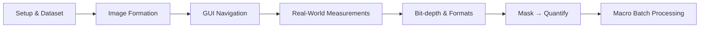

# 🧬 2025 GloBIAS CNR Naples - Fiji for Absolute Beginners
> **A fast‑paced, 4–5 hour crash‑course in digital image formation & Fiji/ImageJ.**  
> Perfect for anyone who has *never* opened an image‑analysis tool before.


<p align="center">
  <a href="LICENSE"></a>
  <a href="#course-map"></a>
  <a href="data"></a>
</p>

Welcome!  This repo bundles **slides, step‑by‑step tutorials, macros, and a sample dataset** so you can learn (or teach) the foundations of bio‑image analysis with nothing more than open‑source software.

---
## 🚀 Quick Start
```bash
# 1. Clone the course
$ git clone https://github.com/your‑org/fiji‑beginners.git
$ cd fiji‑beginners

# 2. Download & unzip Fiji
$ open https://fiji.sc  # grab the latest for your OS

# 3. Launch Fiji and allocate RAM (75 % of system)

# 4. Open the sample dataset
File ▸ Open ▸ data/cells_tl_zc.tif
```
Now jump into **Tutorial 1** in [`tutorials.md`](tutorials.md).

---
## 🗺️ Course Map <a name="course-map"></a>

Each block is a 30–50 minute guided exercise; the whole path takes **≈ 5 hours** including breaks.

---
## 📂 Repository Layout
| Path | Contents |
|------|----------|
| `tutorials.md` | **Single‑file handbook** – all six tutorials. |
| `Fiji_Beginners_Tutorials.docx` | Printable DOCX of the handbook. |
| `data/` | Sample TIFF hyperstack (40 MB). |
| `macros/` | Example macro (`batch_projection.ijm`). |
| `assets/` | Screenshots & banners for docs/GitHub Pages. |
| `cheat_sheet.pdf` | A5 quick‑reference card. |
| `docs/` | GitHub Pages site (same narrative, nicer layout). |

> **Tip for instructors:** fork the repo, add your own images to `data/`, commit, and you’re ready for class.

---
## 🖥️ Screenshots
| Fiji GUI | Threshold → Mask → Analyze Particles |
|---|---|
|  |  |

*(Replace placeholder images in `assets/` with real screenshots from your session.)*

---
## 📚 Further Reading
- **Image.sc forum** – community Q&A: <https://forum.image.sc>
- **NEUBIAS Academy** – bite‑sized Fiji video tutorials.
- **Fiji Cookbook v2 (2024)** – curated recipes.

---
## 🤝 Contributing
Pull requests, issues, and typo fixes are welcome.  
For larger changes, open an issue first to discuss scope and style.

---
## © License
*Text & screenshots* – **Creative Commons BY‑SA 4.0**  
*Code snippets & macros* – **MIT License**
