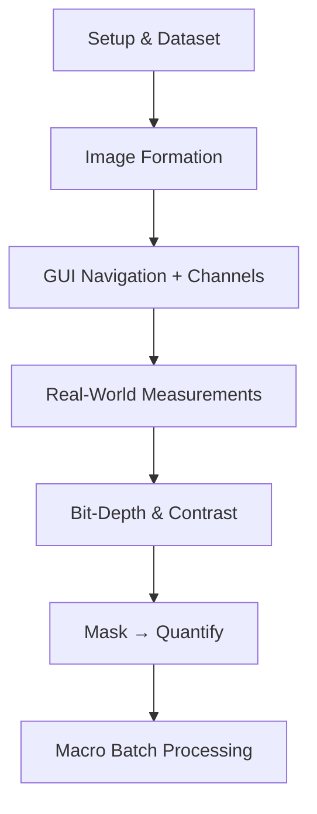

# 🧬 Fiji for Absolute Beginners – Tutorial Pack (v1.1)


<p align="center">
  <a href="LICENSE"></a>
  <a href="#roadmap"></a>
  <a href="data"></a>
</p>

> **A five‑hour crash‑course** that turns absolute beginners into confident Fiji/ImageJ users.

---
## 🚀 Quick Start
```bash
# 1 · Clone the course
$ git clone https://github.com/your-org/fiji-beginners.git
$ cd fiji-beginners

# 2 · Download & unzip Fiji
$ open https://fiji.sc  # grab the latest for your OS

# 3 · Launch Fiji and allocate RAM (≈ 75 % of system)

# 4 · Open the sample dataset
File ▸ Open ▸ data/cells_tl_zc.tif
```

---
## 🗺️ Course Map <a name="roadmap"></a>


---
## 📂 Repository Layout
| Path | Contents |
|------|----------|
| `tutorials.md` | Step‑by‑step handbook (all six tutorials). |
| `Fiji_Beginners_Tutorials.docx` | Printable DOCX version. |
| `data/` | Sample hyperstack (≈ 40 MB). |
| `macros/` | Example macro `batch_projection.ijm`. |
| `assets/` | Screenshots & banners. |
| `cheat_sheet.pdf` | A5 quick‑reference card. |

---
## 📖 Tutorial List (with timing)
| # | Title | Time |
|---|-------|------|
| 1 | Image Formation Essentials | 45 min |
| 2 | Navigating Fiji & Channels | 55 min |
| 3 | Measuring Real Sizes + Scale‑Bar | 45 min |
| 4 | Bit‑Depth, Contrast & HiLo | 30 min |
| 5 | Threshold → Mask → Quantify | 50 min |
| 6 | Macro Recording for Batch Work | 35 min |

Total guided time ≈ **5 h** (plus short breaks).

---
## 🛠️ Skill‑Building Road‑Map
| Stage | Topic | Level |
|-------|-------|-------|
| 1 | Setup & metadata inspection | Core |
| 2 | Brightness/Contrast & HiLo | Core |
| 3 | LUTs & calibration bar | Core |
| 4 | Spatial calibration & graphic scale‑bar | Core |
| 5 | Channel handling | Core |
| 6 | Bit‑depth conversion | Core |
| 7 | ROI Manager & measurements | Core |
| 8 | Noise filters | Core |
| 9 | Background subtraction (rolling‑ball) | Backup |
| 10 | Threshold → mask → count | Core |
| 11 | Macro Recorder | Core |
| 12 | Local threshold & morphological ops | Advanced |
| 13 | Edge detection & FFT | Advanced |
| 14 | Quantitative fluorescence (CTCF) | Advanced |
| 15 | Time‑series analysis & montage | Advanced |
| 16 | 3‑D rendering & tracking | Advanced |

---
## 🧠 Memory Boost – quick analogies
| Idea | Picture it as… |
|------|----------------|
| **Pixel** | one **LEGO® brick** in a wall—tiny alone, mighty together. |
| **LUT** | putting on **coloured sunglasses**: colours change, reality doesn’t. |
| **Bit‑depth** | a stack of **mailboxes**: more boxes, more unique messages (intensity levels). |
| **Rolling‑ball background** | a **rolling pin** flattening icing—levels the big bumps, keeps the sprinkles (features). |
| **Macro Recorder** | a **self‑writing recipe**: cook once, the steps are written; next time just press *Play*. |

---
## 🙏 Acknowledgments
Created by **Daniel Waiger** and the **GloBIAS** team.

Inspiration drawn from:
* **WIS Fiji Hands‑On v1.14** — *Ofra Golani* & *Reinat Nevo* (Weizmann Institute) — channel handling and background cleanup.
* **Fiji Training 1** — *Adel Zeidan* & *Liza Yehiam* (BCF Imaging Center); edited by *Lior Liba* & *Ofra Golani* with contributions from *Daniel Waiger* & *Einat Zelinger* — histogram and metadata tips.
* **Fiji Training 2** — *Martin Fitzpatrick* (University of Birmingham) — fluorescence‑intensity measurement workflow.

---
© 2025 GloBIAS CNR Naples • Content licensed **CC‑BY‑SA 4.0** • Code & macros **MIT**
