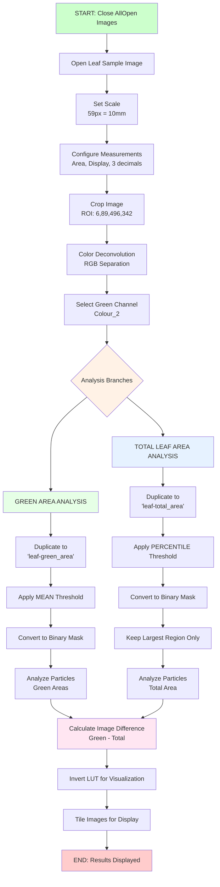
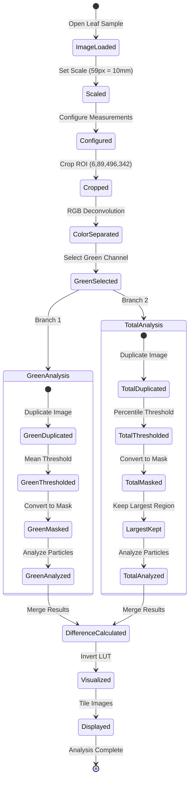

# Leaf Green Area Analysis - Visual Flowchart

## Mermaid Flowchart

## Process Summary Table

| Step | Process | Input | Output | Purpose |
|------|---------|-------|--------|---------|
| 1 | Image Setup | Raw leaf image | Scaled, cropped image | Prepare for analysis |
| 2 | Color Separation | RGB image | Individual color channels | Isolate green information |
| 3a | Green Analysis | Green channel | Binary mask (green areas) | Identify healthy tissue |
| 3b | Total Analysis | Green channel | Binary mask (leaf outline) | Identify total leaf area |
| 4 | Particle Analysis | Binary masks | Area measurements | Quantify regions |
| 5 | Comparison | Both measurements | Difference calculation | Calculate damage percentage |
| 6 | Visualization | All results | Tiled display | Present final results |

## Key Measurements Output

- **Green Area (mm²)**: Healthy chlorophyll-containing regions
- **Total Area (mm²)**: Complete leaf outline  

## Mermaid State Diagram - Analysis States

