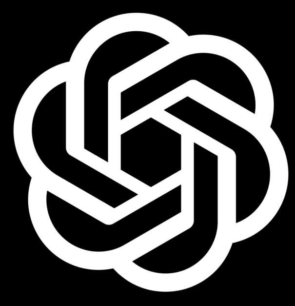

<!-- Hero Section -->

  

    <h1 class="hero-title">🧬 Fiji for Absolute Beginners</h1>
    <h2 class="hero-subtitle">GloBIAS & CNR Naples 2025 Workshop</h2>
    
    

      🗓️ July 7-11, 2025
      🧪 Hands-on Training
      🤖 AI-Enhanced
      📊 Interactive
    

    
    

      
      
      
    

    

      Intensive fluorescence image analysis workshop with hands-on sessions, interactive segmentation, and AI-enhanced macro development.
    

    
    <a href="https://globias-bioimageanalysts.github.io/Fluorescence_image_analysis_workshop-GloBIAS_CNR_Naples_2025/" target="_blank" class="btn">
      🌐 Main Workshop Website - For the full programme
    </a>
  

<!-- Quick Navigation -->
<nav class="quick-nav">
  <ul>
    <li><a href="#schedule">📅 Schedule</a></li>
    <li><a href="#objectives">🎯 Objectives</a></li>
    <li><a href="#installation">🔧 Setup</a></li>
    <li><a href="#materials">📚 Materials</a></li>
    <li><a href="#macros">⚡ Macros</a></li>
    <li><a href="#tips">💡 Tips</a></li>
    <li><a href="#faq">❓ FAQ</a></li>
  </ul>
  <button class="theme-toggle" id="themeToggle">
    🌙
    Dark
  </button>
</nav>

## 📅 Detailed Schedule

  

    <h3>📅 Day 1 – Monday, July 7th, 2025</h3>
    

      
13:00–14:00

      
Introduction to FIJI

      
📊 <a href="slides/Day1/01_Introduction_to_Image_Analysis.pptx">Slides Available</a>

    

    

      
14:00–15:00

      
Showcase of FIJI plugins for bioimage analysis

      
with Ana Stojiljković

    

    

      
15:30–16:30

      
ilastik for interactive segmentation

      
📁 <a href="slides/Day1/">Day 1 Materials Available</a>

    

  

  
  

    <h3>📅 Day 2 – Tuesday, July 8th, 2025</h3>
    

      
09:30–10:30

      
Automatisation of bioimage analysis with ImageJ macro powered by large language models

      
📊 <a href="slides/Day2/Enhancing_Image_Analysis_Communication_with_ChatGPT_with_Speaker_Notes.pptx">Slides Available</a>

    

    

      
11:00–12:00

      
ImageJ macro practical session

      
with Daniel Waiger and Ana Stojiljković • 📊 <a href="slides/Day2/2020418_ImageJMacro.pdf">Programming Guide</a> • 📄 <a href="macros/">Macros Available</a>

    

    

    

      
15:30–17:00

      
Project working groups

      
with Sebastian Gonzalez Tirado

    

  

## 🎯 Learning Objectives

  

    <h4>🖼️ ImageJ/Fiji Fundamentals</h4>
    
Master image loading, bit-depth conversion, and understand how different formats affect analysis

  

  

    <h4>📊 Intensity Analysis</h4>
    
Learn to interpret intensity histograms and understand scaling effects on measurements

  

  

    <h4>🎨 Visualization</h4>
    
Apply contrast adjustments and LUTs to enhance image visualization and interpretation

  

  

    <h4>📏 ROI Tools</h4>
    
Use region of interest tools for precise intensity measurements and analysis

  

  

    <h4>📐 Spatial Calibration</h4>
    
Set proper spatial calibrations and add professional scale bars to images

  

  

    <h4>🔍 Segmentation</h4>
    
Perform automatic segmentation and particle analysis for quantitative results

  

  

    <h4>🎭 Region Masking</h4>
    
BONUS: Advanced techniques for region masking and batch processing workflows

  

  

    <h4>🤖 AI Integration</h4>
    
Leverage AI tools to enhance macro development and automate complex workflows

  

## 🔧 Installation & Setup Instructions

  <h3>Pre-Workshop Requirements</h3>
  
Install these tools before the workshop begins:

  

    
1

    

      <h4>🔬 Fiji (ImageJ)</h4>
      
Download from <a href="https://fiji.sc/" target="_blank">fiji.sc</a>. Choose your OS version (Windows/Mac/Linux), extract and run. No additional setup required.

    

  

  

    
2

    

      <h4>🧩 Plugin Update Sites</h4>
      
In Fiji: Help → Update → Manage Update Sites. Enable: CLIJ, StarDist, CSBDeep,TrackMate, PT-BIOP. Restart after updates.

    

  

  

    
3

    

      <h4>🤖 ilastik Interactive Segmentation</h4>
      
Download from <a href="https://www.ilastik.org/download.html" target="_blank">ilastik.org</a>. Install appropriate version for your OS and test launch.

    

  

  

    
4

    

      <h4>🧠 ChatGPT Account</h4>
      
Sign up at <a href="https://chat.openai.com/" target="_blank">chat.openai.com</a>. Free account sufficient for workshop AI macro development.

    

  

  

    
5

    

      <h4>📝 Text Editor</h4>
      
Install VS Code or use Fiji's built-in Script Editor for macro editing and development.

    

  

  

    
6

    

      <h4>📁 Workshop Materials</h4>
      
Clone or download this repository to access all sample images, macros, and training materials.

    

  

## 💡 Good to Know - Tips & Shortcuts

  

    <h4>⌨️ Essential Shortcuts</h4>
    <ul>
      <li><code>Ctrl+O</code> - Open Image</li>
      <li><code>Ctrl+Shift+C</code> - Brightness and Contrast Plugin</li>
      <li><code>Ctrl+Shift+T</code> - Threshold Plugin</li>
      <li><code>M</code> - Measure</li>
    </ul>
  

  

    <h4>🎯 Quick Tips</h4>
    <ul>
      <li>Always duplicate original images before processing</li>
      <li>Use meaningful file naming conventions</li>
      <li>Save ROI sets for reproducible analysis</li>
      <li>Document your analysis pipeline</li>
    </ul>
  

  

    <h4>🔧 Troubleshooting</h4>
    <ul>
      <li>Check image bit-depth before analysis</li>
      <li>Verify spatial calibration settings</li>
      <li>Use "Undo" liberally while learning</li>
      <li>Save macros for repeated workflows</li>
    </ul>
  

  

    <h4>📚 Best Practices</h4>
    <ul>
      <li>Start with simple analysis workflows</li>
      <li>Test parameters on sample images</li>
      <li>Keep detailed analysis logs</li>
      <li>Validate results with manual counts</li>
    </ul>
  

## ❓ Frequently Asked Questions

  

    <button class="faq-question">
      Do I need programming experience?
      +
    </button>
    

      
No programming experience required! This workshop is designed for absolute beginners. We'll start with basic concepts and gradually build up to macro development with AI assistance.

    

  

  

    <button class="faq-question">
      What operating system do you support?
      +
    </button>
    

      
Fiji and ilastik run on Windows, Mac, and Linux. All workshop materials are OS-independent. We'll provide installation help for all platforms.

    

  

  

    <button class="faq-question">
      Can I use my own images?
      +
    </button>
    

      
Absolutely! While we provide sample images for training, you're encouraged to bring your own fluorescence images to work with during practical sessions.

    

  

  

    <button class="faq-question">
      Will materials be available after the workshop?
      +
    </button>
    

      
Yes! This GitHub repository will remain available indefinitely. All slides, macros, sample images, and documentation can be accessed anytime.

    

  

  

    <button class="faq-question">
      Is there ongoing support after the workshop?
      +
    </button>
    

      

        Yes! You can post questions on <a href="https://forum.image.sc/" target="_blank">image.sc</a>—the global forum for bioimage analysis. We encourage you to ask questions there or via GitHub issues on this repository.
      

    

  

## 📚 Workshop Materials & Downloads

  <h3>Complete Resource Library</h3>
  
All workshop materials are available directly from this repository. Download or browse as needed:

  

    
📊

    

      <h4>Presentation Slides</h4>
      <strong>Day 1 Materials:</strong>
      <ul>
        <li><a href="slides/Day1/01_Introduction_to_Image_Analysis.pptx">Introduction to Image Analysis</a></li>
        <li><a href="slides/Day1/Ilastik%20%E2%80%93%20The%20Interactive%20Learning%20And%20Segmentation%20Toolkit.pptx">ilastik Interactive Segmentation</a></li>
        <li><a href="slides/Day1/mitocheck/">Mitocheck Dataset</a> - Cell tracking examples</li>
      </ul>
      <strong>Day 2 Materials:</strong>
      <ul>
        <li><a href="slides/Day2/Enhancing_Image_Analysis_Communication_with_ChatGPT_with_Speaker_Notes.pptx">ChatGPT for Image Analysis</a></li>
        <li><a href="slides/Day2/2020418_ImageJMacro.pdf">ImageJ Macro Programming Guide</a></li>
        <li><a href="slides/Day2/FDA_vs_PI_Scatter_Plot_Combined.html">FDA vs PI Analysis</a> - Interactive visualization</li>
        <li><a href="slides/Day2/Tuna_Analysis_Protocol_Modern.html">Tuna Analysis Protocol</a> - Complete workflow</li>
      </ul>
    

  

  

    
🖼️

    

      <h4>Sample Images</h4>
      
Practice with our curated collection of biological images:

      <ul>
        <li><code>1703.tif</code> - Multi-channel fluorescence</li>
        <li><code>blobs.tif</code> & <code>blobs_noise.tif</code> - Segmentation practice</li>
        <li><code>cells_ActinDNA.tif</code> - Cellular structures</li>
        <li><code>FluorescentCells.tif</code> - Cell analysis</li>
        <li><code>H&E.tif</code> - Histology sample</li>
        <li><code>RGB_cell.tif</code> - Color image processing</li>
        <li><code>m51.tif</code> - Advanced analysis</li>
        <li><code>gel_inv.tif</code> - Gel electrophoresis</li>
      </ul>
      
<strong>Location:</strong> <code>images/</code> folder in repository

    

  

  

    
📖

    

      <h4>Training Manuals</h4>
      <ul>
        <li><a href="manuals/FIJI%20training.pdf">FIJI Training Manual</a> - Complete guide (PDF)</li>
        <li><a href="manuals/FIJI%20training.docx">FIJI Training Manual</a> - Editable version (DOCX)</li>
      </ul>
    

  

  

    
🐍

    

      <h4>Python Scripts</h4>
      
Advanced analysis tools for Python users:

      <ul>
        <li><a href="python%20library/Script%201%20-%20Bit%20Depth%20Examples.py">Bit Depth Examples</a></li>
        <li><a href="python%20library/Script%202%20-%20Overlay%20on%20Original%20Image.py">Image Overlay Script</a></li>
        <li><a href="python%20library/Script%202%20-%20Overlay%20on%20Original%20Image%20-%20all%20bit%20depths.py">Multi-bit Depth Overlay</a></li>
      </ul>
    

  

  

    
🔬

    

      <h4>Advanced Workflows & Examples</h4>
      <ul>
        <li><a href="slides/Day1/mitocheck/">Mitocheck Dataset</a> - Cell tracking examples</li>
        <li><a href="slides/Day2/FDA_vs_PI_Scatter_Plot_Combined.html">FDA vs PI Analysis</a> - Interactive visualization</li>
        <li><a href="slides/Day2/Tuna_Analysis_Protocol_Modern.html">Tuna Analysis Protocol</a> - Complete workflow</li>
      </ul>
    

  

## ⚡ ImageJ Macro Library

  <h3>Complete Macro Collection</h3>
  
Ready-to-use ImageJ macros for common bioimage analysis tasks:

  

    <button class="faq-question">
      01_image_info_conversion.ijm - Image Basics
      +
    </button>
    

      
<strong>Purpose:</strong> Learn image properties, bit-depth conversion, and basic image manipulation

      
<strong>Key Functions:</strong>

      <ul>
        <li>Display image dimensions and properties</li>
        <li>Convert between 8-bit, 16-bit, and 32-bit formats</li>
        <li>Understand how bit-depth affects analysis</li>
      </ul>
      <a href="macros/01_image_info_conversion.ijm" class="btn" style="margin-top: 1rem;">Download Macro</a>
    

  

  

    <button class="faq-question">
      02_histogram_profiles.ijm - Intensity Analysis
      +
    </button>
    

      
<strong>Purpose:</strong> Analyze intensity distributions and create profile plots

      
<strong>Key Functions:</strong>

      <ul>
        <li>Generate intensity histograms</li>
        <li>Create line profile plots</li>
        <li>Understand intensity scaling effects</li>
      </ul>
      <a href="macros/02_histogram_profiles.ijm" class="btn" style="margin-top: 1rem;">Download Macro</a>
    

  

  

    <button class="faq-question">
      03_brightness_contrast.ijm - Image Enhancement
      +
    </button>
    

      
<strong>Purpose:</strong> Master brightness/contrast adjustments and visualization

      
<strong>Key Functions:</strong>

      <ul>
        <li>Adjust display range without changing data</li>
        <li>Apply auto-contrast and normalization</li>
        <li>Understand display vs. data modifications</li>
      </ul>
      <a href="macros/03_brightness_contrast.ijm" class="btn" style="margin-top: 1rem;">Download Macro</a>
    

  

  

    <button class="faq-question">
      04_channels_LUTs.ijm - Multi-channel Imaging
      +
    </button>
    

      
<strong>Purpose:</strong> Handle multi-channel images and apply appropriate color schemes

      
<strong>Key Functions:</strong>

      <ul>
        <li>Split and merge color channels</li>
        <li>Apply lookup tables (LUTs) for visualization</li>
        <li>Create composite images</li>
      </ul>
      <a href="macros/04_channels_LUTs.ijm" class="btn" style="margin-top: 1rem;">Download Macro</a>
    

  

  

    <button class="faq-question">
      05_roi_measurement.ijm - Region Analysis
      +
    </button>
    

      
<strong>Purpose:</strong> Create regions of interest and perform quantitative measurements

      
<strong>Key Functions:</strong>

      <ul>
        <li>Draw and manage ROIs (circles, rectangles, polygons)</li>
        <li>Measure area, intensity, and other parameters</li>
        <li>Save and load ROI sets</li>
      </ul>
      <a href="macros/05_roi_measurement.ijm" class="btn" style="margin-top: 1rem;">Download Macro</a>
    

  

  

    <button class="faq-question">
      06_set_scale_bar.ijm - Spatial Calibration
      +
    </button>
    

      
<strong>Purpose:</strong> Set proper spatial calibration and add professional scale bars

      
<strong>Key Functions:</strong>

      <ul>
        <li>Set pixel size and units (μm, nm, etc.)</li>
        <li>Add calibrated scale bars</li>
        <li>Convert measurements to real-world units</li>
      </ul>
      <a href="macros/06_set_scale_bar.ijm" class="btn" style="margin-top: 1rem;">Download Macro</a>
    

  

  

    <button class="faq-question">
      07_segmentation_particles.ijm - Automated Analysis
      +
    </button>
    

      
<strong>Purpose:</strong> Perform automatic segmentation and particle analysis

      
<strong>Key Functions:</strong>

      <ul>
        <li>Threshold images for segmentation</li>
        <li>Analyze particles (count, size, shape)</li>
        <li>Filter results by size and circularity</li>
      </ul>
      <a href="macros/07_segmentation_particles.ijm" class="btn" style="margin-top: 1rem;">Download Macro</a>
    

  

  

    <button class="faq-question">
      08_masking_regions.ijm - Advanced Masking
      +
    </button>
    

      
<strong>Purpose:</strong> Create and apply masks for selective analysis

      
<strong>Key Functions:</strong>

      <ul>
        <li>Create binary masks from thresholds</li>
        <li>Apply masks to limit analysis regions</li>
        <li>Combine multiple masks with boolean operations</li>
      </ul>
      <a href="macros/08_masking_regions.ijm" class="btn" style="margin-top: 1rem;">Download Macro</a>
    

  

  

    <button class="faq-question">
      09_ctcf_fluorescence.ijm - Fluorescence Quantification
      +
    </button>
    

      
<strong>Purpose:</strong> Calculate Corrected Total Cell Fluorescence (CTCF) for accurate quantification

      
<strong>Key Functions:</strong>

      <ul>
        <li>Measure integrated density and background</li>
        <li>Calculate CTCF = Integrated Density - (Area × Mean Background)</li>
        <li>Export results for statistical analysis</li>
      </ul>
      <a href="macros/09_ctcf_fluorescence.ijm" class="btn" style="margin-top: 1rem;">Download Macro</a>
    

  

---

  <h2>🚀 Ready to Begin?</h2>
  
Everything you need is right here on this page!

  

    <a href="#schedule" class="btn">📅 View Schedule</a>
    <a href="#materials" class="btn">📚 Download Materials</a>
    <a href="#macros" class="btn">⚡ Get Macros</a>
    <a href="#installation" class="btn">🔧 Setup Guide</a>
    <a href="#tips" class="btn">💡 Tips & FAQ</a>
  

  

    <strong>Note:</strong> All original organized folders have been moved to the <code>archive/</code> directory for reference.
  

<!-- Back to Top Button -->
<a href="#hero" class="back-to-top" id="backToTop">↑</a>

